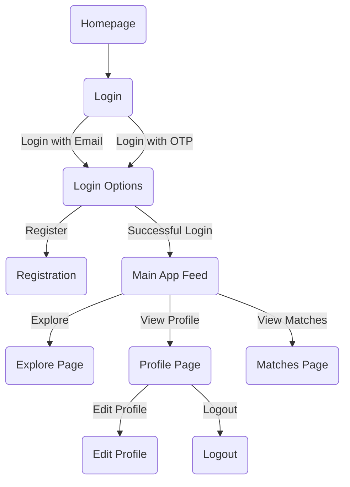

# Bonnd - Friends Social Media Application

Welcome to Bonnd, a social media application designed to connect friends and foster meaningful connections. Bonnd is built using the MERN stack (MongoDB, Express.js, React.js, and Node.js) and is organized into three separate repositories: Backend, Image Backend, and Frontend.
## System Design


## Schema Tables


## Flow of the Project



## Installation

To run Bonnd you have to start 3 development server

- Frontend
- Backend
- Image Backend

### Frontend

To start Frontend Server run the following commands

```bash
git clone https://github.com/Rcoem-Friends/Frontend.git
cd Frontend
npm install
npm run dev
```


### Backend

Before running the backend server, ensure you have set up the required environment variables. Create a `.env` file in the root of the project with the following contents:

```env
# Example .env file

PORT = <Enter the port>
MONGODB_URL = <Enter your MONGODB_URL>

JWT_ACCESS_KEY = <Put your access key>


NODEMAILER_EMAIL = <Put your email id>
NODEMAILER_PASSWORD = <Put the app password for the email (16 alphabets remove space)>
```

To start Backend Server run the following commands

```bash
git clone https://github.com/Rcoem-Friends/Backend.git
cd Backend
npm install
nodemon app.js
```

### Image Backend

Before running the Image Backend server, ensure you have set up the required environment variables. Create a `.env` file in the root of the project with the following contents:

```env
MONGODB_URI=<Enter your MONGODB_URI>
PORT=<Enter your Port>
```

To start Image Backend Server run the following commands

```bash
git clone https://github.com/Rcoem-Friends/Image_Backend.git
cd Image_Backend
npm install
nodemon index.js
```


## Flow of the Project

### 1. Homepage

- The journey begins on the Homepage, where users can explore and learn more about Bonnd.


### 2. Login

- Users can click on the "Login" button to access the login page.
  


### 3. Login Options

- The login page provides two options: "Login with Email" and "Login with OTP."
- Users can choose the preferred login method.


### 4. Registration

- Users without an account can click on the "Register" link to create a new account.


### 5. Main App Feed

- After successful login or registration, users are redirected to the main app feed page.
- The feed page showcases updates and activities from connected friends.


### 6. Profile Page

- Users can navigate to the "Profile" page to view and edit their profile details.


### 7. Matches Page

- The "Matches" page displays potential connections and mutual matches.


### 8. Edit Profile

- Users can edit their profile by clicking on the "Edit Profile" option.


### 9. Unknown Page

- Users can securely log out from the application.


## Setup

Follow the setup instructions in the previous section to get started with the Bonnd application.

## Contributing

We welcome contributions from the community. If you find a bug or have a suggestion, please open an issue. For code contributions, fork the repository, create a branch, and submit a pull request.

Happy connecting! 🌐🚀

